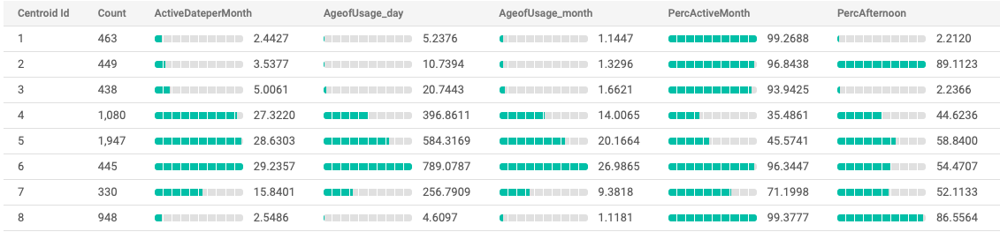

# Customer Segmentation
 Perform customer segmentation using BigQuery ML

## Dataset
Supermarket dataset, the same data as used in Customer Single View.

## K-Means Clustering using BigQuery ML
Create KMean model using BigQuery ML using the result from Customers Single View as features with [bq-ml-kmeans-customers-segmentation.sql](./bq-ml-kmeans-customers-segmentation.sql)

## Clustering Result
Centroid value for each feature from BigQuery UI.

