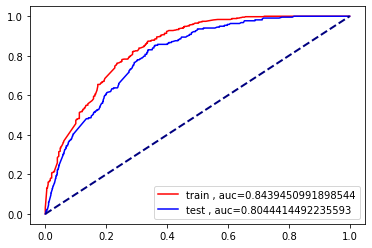

# Campaign Response Model
 path of BADS7105 Customer Relationship Management Analytics

## Dataset
A retail dataset consists of 2 files.
- [Retail_Data_Transactions.csv](./Retail_Data_Transactions.csv) has 3 columns customer_id, trans_date, tran_amount which is on customer's basket level.
- [Retail_Data_Response.csv](./Retail_Data_Response.csv) has 2 columns customer_id, response which 0 is not response and 1 is response.

## Feature Engineering
The example from the teacher has three features, Recency, Frequency, and Monetary. which give with test-auc score around 0.70 ~ 0.72. The additional features are below.
 - aou	is age of usage
 - ticket_size	is average ticket size of each user
 - frequency_2y	is frequency in latest 2 year
 - monetary_value_2y	is monetary in latest 2 year
 - ticket_size_2y is average ticket size of each user in latest 2 year

## Train models
I use all features from previous step with Logistics Regression, SVM, Decision Tree, Random Forest, XGBoost and resampling by oversampled, undersampled, and SMOTE. 

## Model Performance
All model give test-auc score around 0.76 ~ 0.8. The best model is XGBoost + oversampled with test-auc score 0.804.

