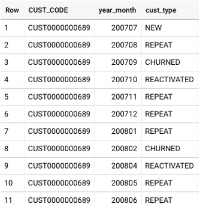
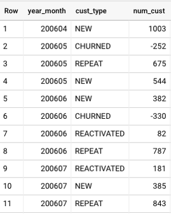
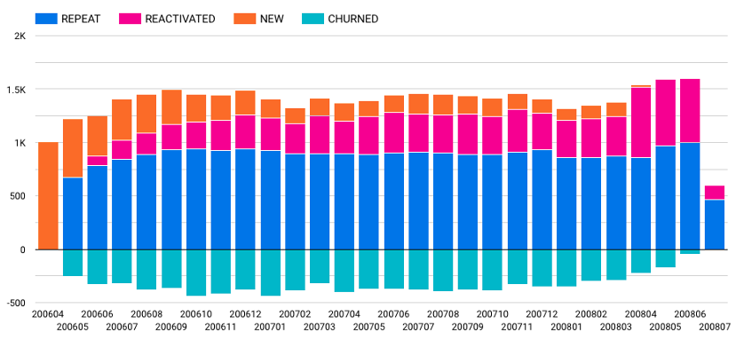

# Customer Movement Analysis
In each month, customers are group into 4 categories.
- New Customer is customer who made purchases first time in this month.
- Repeat Customer is customer who made purchases this month (m) and previous month (m-1).
- Reactivated Customer is customer who made purchases this month (m) but not purchase previous month (m-1).
- Churn Customer is the customer who made purchases the previous month (m-1) but not purchases this month (m).

## Dataset
Supermarket dataset in BigQuery, the same data as used in Customer Single View and Customer Segmentation.

## Data Preparation
First, use SQL to group customers each month.

Then, count categories of the customer each month.

## Result
Visualize the result after executing the SQL using Google Data Studio. 

